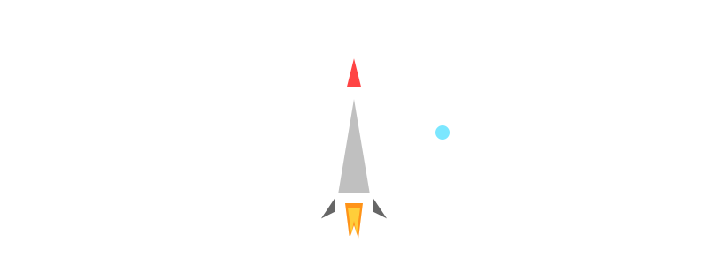

<!-- External SVG keeps SMIL animations alive (GitHub strips them from inline SVG) -->

 

<!-- Quick Stats Strip -->

-ff2bd6?style=for-the-badge&labelColor=1a0533)

---

## 🛰️ Mission Brief

> Advancing reusable aerospace systems through **nonlinear aeroelastic stability analysis**, **rigorous certification practice**, and **strategic technology integration** — engineered for the rapid-iteration culture that defines Raptor and Starship.

Christopher Kaminski is a Duke Ph.D. candidate developing harmonic balance solvers for non-synchronous vibrations in turbomachinery, with prior systems engineering experience on the **B-21 Raider** program and dual exposure to defense-tech integration and venture capital due diligence. This portfolio is a living, version-controlled artifact of that trajectory.

---

## 🌅 Flight Phases — Deep Dives

<table>
<tr>
<td width="50%" valign="top">

### 🎓 1. Research & Education
**Duke Ph.D. — Aeroelasticity Group**
*Aug 2022 – Present • Durham, NC*

Harmonic balance solvers for nonlinear flow instabilities. Direct line to other high profile aerospace projects..

[**→ Open Deep Dive**](./projects/education/)

</td>
<td width="50%" valign="top">

### 🛩️ 2. Northrop Grumman
**B-21 Program — Systems Engineering**
*Jun 2021 – Aug 2022 • Secret + SAP*

ECS & Fuel airworthiness certification, VMS requirements. Hard-won **validation rigor**.

[**→ Open Deep Dive**](./projects/northrop-grumman/)

</td>
</tr>
<tr>
<td width="50%" valign="top">

### 💼 3. Duke Capital Partners
**Sr. VC Associate**
*Sep 2024 – Present*

Deep-tech / aerospace investment screening, data-room diligence, leadership interviews, investment memos.

[**→ Open Deep Dive**](./projects/duke-capital-partners/)

</td>
<td width="50%" valign="top">

### 🛠️ 4. Archaius Inc.
**Engineering & Growth Strategy**
*Sep 2025 – Present*

Proprietary anti-jamming tech integrated into government-test drones. Series A prep.

[**→ Open Deep Dive**](./projects/Archaius-SAFE-to-SeriesA/)

</td>
</tr>
</table>

---

## 📡 Skills Telemetry

**Numerical Methods** &nbsp;·&nbsp; Harmonic Balance &nbsp;·&nbsp; Global Stability Analysis &nbsp;·&nbsp; Fluid-Structure Interaction &nbsp;·&nbsp; CFD

**Languages** &nbsp;·&nbsp; Fortran &nbsp;·&nbsp; Python &nbsp;·&nbsp; MATLAB &nbsp;·&nbsp; Bash

**Engineering Practice** &nbsp;·&nbsp; Requirements Traceability &nbsp;·&nbsp; Airworthiness Certification &nbsp;·&nbsp; V&V &nbsp;·&nbsp; Systems Integration

**Strategy** &nbsp;·&nbsp; Technical Due Diligence &nbsp;·&nbsp; Investment Memos &nbsp;·&nbsp; Defense-Tech Partnerships

---

### 📬 Contact

Request **collaborator access** for full technical artifacts:
Fortran solvers · Python certification scripts · CFD visualizations · Verification matrices · Anonymized investment memos

This portfolio is a private, version-controlled repository. Recruiters are invited as collaborators.

