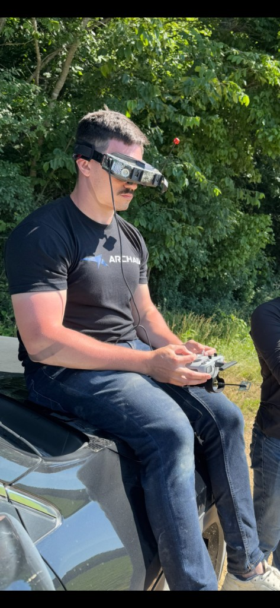
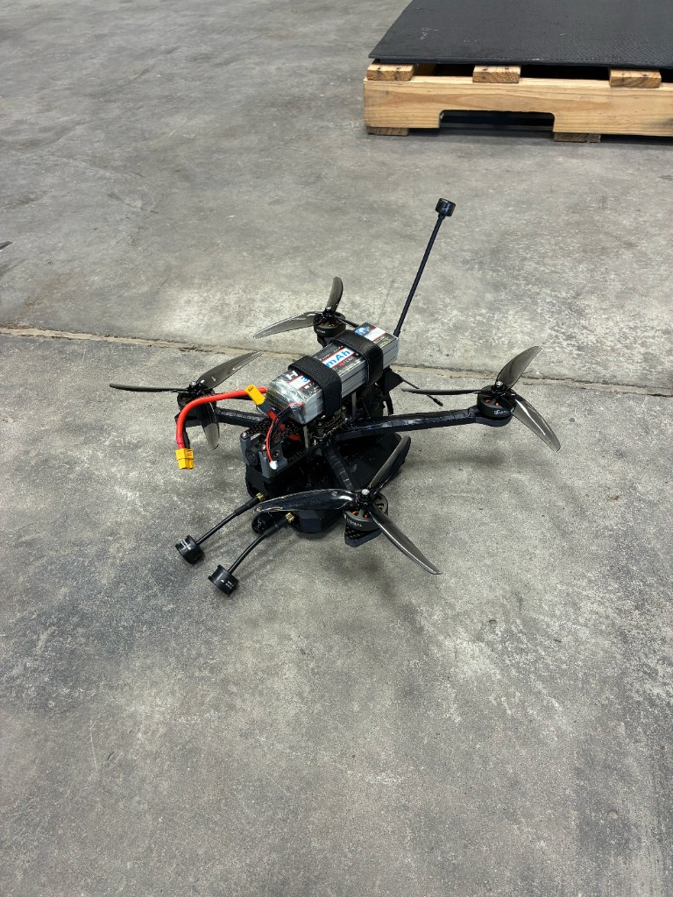
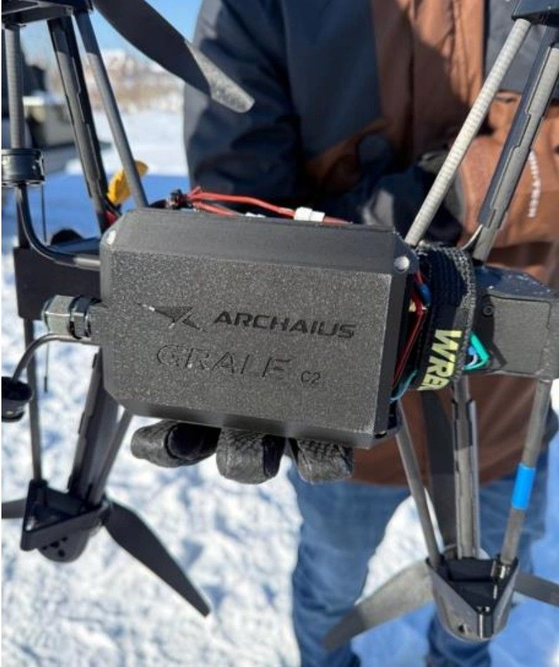

# 4. Archaius: SAFE To Series A Startup Bootstrapping 🛠️

**Archaius Inc. – Engineering & Growth Strategy Intern** | September 2025 – Present

[← Back to Mission Control](../../README.md)

---

### Achievements
- Built a custom Ardupilot and Betaflight branch to integrate Archaius product capabilities onto a variety of drone platforms.
- Worked directly with Ukrainian partners to facilitate systems integration onto their existing drone platforms
- Engaged in Series A Dataroom preparatory work and participated on calls with VC firms for raise, using prior VC experience to help secure the right partners & terms.

---

### Project Highlights

---

#### 01 — Live Flying & Testing with 101st Airborne — Ft. Campbell, KY

<table>
<tr>
<td width="50%" valign="top" align="center">

<em>On-console with Army operators — flying and demonstrating Grale C2 in the field.</em>

</td>
<td width="50%" valign="top" align="center">

<em>Attritable Battlefield Enabler (ABE) platform — Grale C2 integrated into the existing stack.</em>

</td>
</tr>
</table>

- **Operator-facing integration:** Worked directly with U.S. Army operators from the 101st Airborne to fit Archaius's **Grale C2** product into their existing **Attritable Battlefield Enabler (ABE)** drone.
- **Systems bring-up under real time constraints:** I was handed the drone directly by US Army personnel as I arrived on base. Under tight time constraints in a forward deployed workshop, I worked through several software & hardware integration issues in order to be ready for the demo.
- **Flew the demo:** Piloted and demonstrated Grale C2 capabilities live for the unit on a U.S. Army drone. Using knowledge about our subsystem's capabilities allowed me to successfully show all that our product was capable of in an easily digestible and impactful demonstration.
- **Compiled feedback and observations into technical test report:** Captured operator input and test data from the live session to build out the case not only for procurement by the 101st, but also for investment by VCs in the upcoming Series A.

---

#### 02 — Partner Drone Build-Out — Live Demonstrations in Ukraine

<em>Grale C2 integrated onto a partner airframe for live demos with forward-deployed Ukrainian teams.</em>

- **Built out a series of drones with our product integrated:** Configured and assembled demo airframes with Grale C2 onboard in order to facilitate live demonstrations in Ukraine.
- **Worked with a drone manufacturer on specs and integration:** Aligned input/output specifications and other integration requirements with a drone partner so the product could be rapidly integrated for test work.
- **Have provided live "tech support" for the forward deployed teams to Ukraine:** Have been available for live calls to quickly turnaround integrations with new drone products. This often includes building out new firmware revisions for different flight controllers, some of which can be a challenge given that they are homegrown Ukrainian systems.

---

#### 03 — Series A Preparatory Work

- **Took disparate Testing & Evaluation data and prepped it for Series A dataroom:** I noticed that while we had a plethora of testing data, much of it was not standardized. I trained a Claude skill to efficiently take a wide variety of different testing data and create reports that would be suitable for VCs. This helped make our dataroom more robust and create the case for our valuation.
- **Did a full dataroom gap analysis and provided recommendations to C-suite:** Based on my prior Venture Capital experience, I went through Archaius' existing dataroom and conducted a gap analysis. I was able to pinpoint a few weak spots and preemptively make improvements such that VCs will have their diligence questions answered in a satisfactory manner.
- **Participated in calls with VCs, both technical and nontechnical:** My VC experience also made me a valuable asset in Series A meetings with outside venture firms. Given that I have an intuitive understanding of what VCs are looking for, I was able to present Archaius' case effectively. 

---

[← Back to Mission Control](../../README.md)

