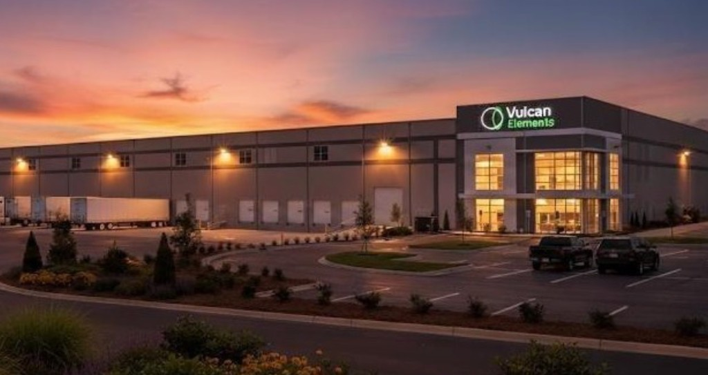
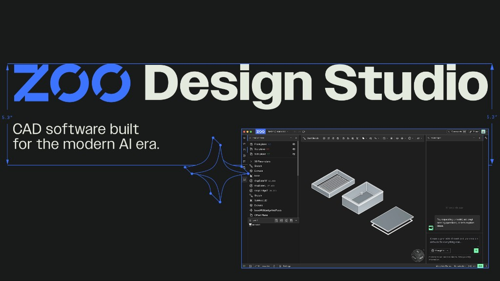

# 💼 Duke Capital Partners — Case Studies in AI & Hard Tech Investments

**Senior Venture Capital Associate** &nbsp;·&nbsp; Sep 2025 – Present
**Venture Capital Associate** &nbsp;·&nbsp; Sep 2024 – Sep 2025

[← Back to Mission Control](../../README.md)

---

## 🇺🇸 Broader Investment Thesis — Tangible, Substantive American Dynamism

> When I first joined Duke Capital Partners, the portfolio was heavily weighted towards biotech and SaaS companies. As hard tech investment began to grow in prominence around 2024, I was well positioned with my hard-tech aerospace background to direct DCP investment towards this burgeoning sector. To me, true abundance means success at a civilizational level, far beyond pure economic metrics. Therefore, I believe we ought to prioritize companies that can not only drive great returns, but also create technological advancement that meaningfully advances human capability and consciousness. 

As AI models began to gain capabilities at rates representative of exponential growth curves, I realized that the SaaS business model which had dominated Silicon Valley for so long was coming to an end. In its place, I believe, a wave of companies would use the efficiency increases presented by AI advancement to build in the world of atoms, not just in the world of bits. In short, software development would get commoditized, and hardware would represent a new moat. My thesis is generally in line with the American Dynamism Manifesto by the VC firm Andreessen Horowitz.

Together with the Duke Capital Partners operations team, I have led the allocation of millions of dollars to deep tech startups.

---

## 🛠️ Case Study 01 — Proto-Town

<em>The entrance to Proto-Town — a physical community for hard-tech founders building outside the bay-area orbit.</em>

### 📋 Deal Snapshot

| | |
|---|---|
| **My Role** | Sourced the opportunity; led both DCP screening calls; directed diligence |
| **Stage** | Early — Seed Round |
| **Geography** | Central Texas (Austin orbit) |
| **Status** | ✅ Closed |

### My Role

- **Sourced** After learning about Proto-Town in my personal research, I immediately reached out to the founders to arrange a call with DCP.
- **Built the internal case** across two screening calls — framed the opportunity to the partnership against the broader Austin hard-tech migration
- **Led the due diligence**: founder interviews, discussion of overall thesis, reviewing the capabilities of the team
- **Got DCP an allocation & Closed** Round was oversubscribed, but we were able to leverage our Duke connection and talent-pipeline leverage.

### Why It Maps to the Thesis

This deal is American Dynamism executed at the **infrastructure layer** rather than the product layer.

The SpaceX IPO has created a large concentration of high-end hardware talent combined with financial liquidity. Similar to how the early 2010s IPOs contributed to the development of Silicon Valley, I anticipate the SpaceX IPO will create a plethora of hard-tech companies which implement the SpaceX ethos in entirely new domains. Just as China has Shenzhen, America needs a geographically concentrated region for rapid hardware prototyping. Proto-Town aims to become the Y-Combinator of hard tech, and it has the backing and talent to implement this vision.

I am particularly proud of getting Duke Capital Partners involved in Proto-Town because I hope that this will build out a pipeline of startup talent to the networks necessary to go from 0 to 1. Proto-Town is valuable to Duke Engineering as a whole because it gives Duke students the ability to rapidly implement their startup idea in an environment with the physical tooling and density of hardware talent, increasing the talent output of Duke University as a whole. 

---

## 🛠️ Case Study 02 — Vulcan Elements

<em>Vulcan Elements — domestic rare earth magnet manufacturing scaled for a China-free supply chain.</em>

### 📋 Deal Snapshot

| | |
|---|---|
| **My Role** | Participated in Company Screening; Led the development of internal diligence report |
| **Stage** | Series B |
| **Geography** | Benson, NC (Research Triangle corridor) |
| **Status** | ✅ Closed |

### My Role

- **Screened** Participated in the screening call and got an intuitive understanding of how the leadership operates. I personally observed a hardware ethos similar to early SpaceX/Tesla, and I decided to push for DCP investment. 
- **Prepared the diligence report** I did a full diligence of the company's dataroom, finding out why Vulcan **specifically** will succeed. Founder fit, public<>private partnerships stood out to me in diligence process.

### Why It Maps to the Thesis

This deal also fits into a necessary part of the larger American Dynamism thesis. Without domestic production of rare-earth magnets, nearly every heavy industry is beholden to Chinese-sourced components. This deal sees the market opportunity for rare-earth magnets given the increase in humanoid robotics and EV production, and all while making domestic tech manufacturing far more resilient. 

Vulcan Elements manufactures sintered NdFeB magnets on U.S. soil and is building a ~$1B facility in Benson, NC to scale toward 10,000 tonnes of capacity, backed by a multi-hundred-million-dollar partnership with the Department of War's Office of Strategic Capital and upstream partner ReElement Technologies. This large local presence gives DCP an allocation in a company that is a critical part of the American tech manufacturing supply chain, all while being near the Research Triangle. This deal benefits DCP as a fund by giving Duke a direct talent pipeline to what is expected to be a major manufacturing hub. 

---

## 🛠️ Case Study 03 — Zoo.dev

<em>Zoo Design Studio — CAD infrastructure built for the AI era of hardware design.</em>

### 📋 Deal Snapshot

| | |
|---|---|
| **My Role** | Led diligence; briefed DCP HNW network; drove close |
| **Stage** | Seed |
| **Geography** | Los Angeles, CA |
| **Status** | ✅ Closed |

### My Role

- **Met the founders** Held direct conversations with the founders Jordan Noone and Jessie Frazelle and asked diligence questions in order to build the rationale for investment in an AI landscape which is fraught with companies that lack substance.
- **Led the diligence** Conducted a full walkthrough of the Seed Round data room. Built out an internal DCP diligence memo which distilled the company data into a cohesive investment thesis. 
- **Worked directly with high profile DCP investor** Met individually with a high-net-worth investor in the DCP network to explain the thesis and build conviction ahead of allocation
- **Drove the close** Converted diligence + network alignment into a substantive DCP investment

### Why It Maps to the Thesis

For hardware to proliferate akin to software, the speed of iteration and development must increase in the AI era. I see Zoo.dev as having the experienced founders and traction with partner companies to make a tangible difference in accelerating the hardware development cycle. 

Much of the software tooling hardware engineers generally use is clunky and not optimized for the rapid development cycles that frontier AI now enables. To make hard-tech startups more viable, it is necessary to make the hardware development processes operate at a comparable speed to software. Zoo had an AI-native CAD stack and a proprietary geometry engine which I believe will serve as a moat to other large AI companies. 

With the commoditization of software, the ability to ship hardware quickly is the new moat. Zoo.dev looks to enable this rapid iteration cycle which can lead to a hardware renaissance, hence the high-conviction DCP investment.

---

[← Back to Mission Control](../../README.md)

