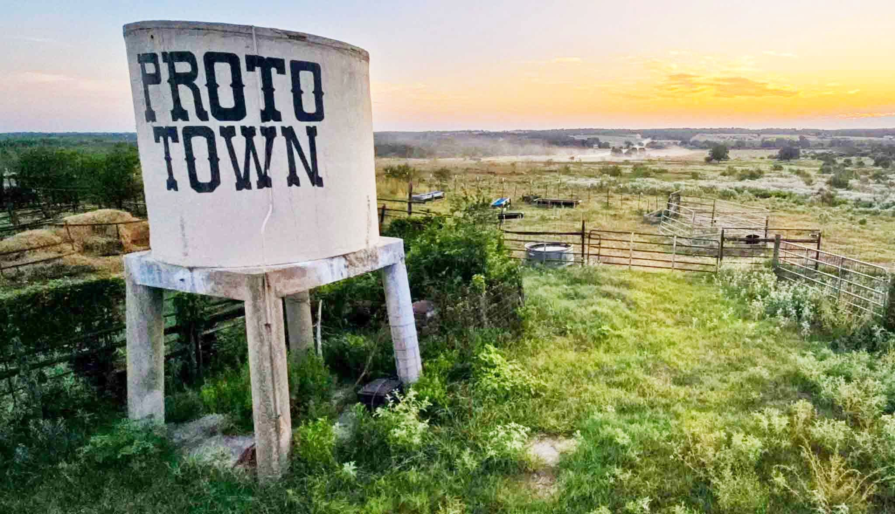

# 💼 Duke Capital Partners — Case Studies in AI & Hard Tech Investments

**Senior Venture Capital Associate** &nbsp;·&nbsp; Sep 2025 – Present
**Venture Capital Associate** &nbsp;·&nbsp; Sep 2024 – Sep 2025

[← Back to Mission Control](../../README.md)

---

## 🇺🇸 Broader Investment Thesis — Tangible, Substantive American Dynamism

> When I first joined Duke Capital Partners, the portfolio was heavily weighted towards biotech and SaaS companies. As hard tech investment began to grow in prominence around 2024, I was well positioned with my hard-tech aerospace background to direct DCP investment towards this burgeoning sector. To me, true abundance means success at a civilizational level, far beyond pure economic metrics. Therefore, I believe we ought to pritoritize companies that can not only drive great returns, but also create technological advancement that meaningfully advances human capability and consciousness. 

As AI models began to gain capabilities at a rates representative of exponential growth curves, I realized that the SaaS business model which had dominated Silicon Valley for so long was coming to an end. In its place, I believe, a wave of companies would use the efficeincy increases presented by AI advancement to build in the world of atoms, not just in the world of bits. In short, software development would get commoditized, and hardware would represent a new moat. My thesis is generally in line with the American Dynamism Manifesto by the VC firm Andreesen Horowitz.

---

## 🛠️ Case Study 01 — Proto-Town

<em>The entrance to Proto-Town — a physical community for hard-tech founders building outside the bay-area orbit.</em>

### 📋 Deal Snapshot

| | |
|---|---|
| **My Role** | Sourced the opportunity; led both DCP screening calls; directed diligence |
| **Stage** | Early — Seed Round |
| **Geography** | Central Texas (Austin orbit) |
| **Status** | ✅ Closed |

### My Role

- **Sourced** After learning about Proto-Town in my personal research, I immediately reached out to the founders to arrange a call with DCP.
- **Built the internal case** across two screening calls — framed the opportunity to the partnership against the broader Austin hard-tech migration
- **Led the due diligence**: founder interviews, discussion of overall thesis, reviewing the capabilities of the team
- **Got DCP an allocation & Closed** Round was oversubscribed, but we were able to leverage our Duke connection and talent-pipeline leverage.

### Why It Maps to the Thesis

This deal is American Dynamism executed at the **infrastructure layer** rather than the product layer.

The SpaceX IPO has created a large concentration of high-end hardware talent combined with financial liquidity. Similar to how the early 2010s IPOs contributed to the development of Silicon Valley, I anticipate the SpaceX IPO will create a plethora of hard-tech companies which implement the SpaceX ethos in entirely new domains. Just as China has Shenzhen, America needs a geographically concentrated region for rapid hardware prototyping. Proto-Town aims to become the Y-Combinator of hard tech, and it has the backing and talent to impelment this vision.

I am particuarly proud of getting Duke Capital Partners involved in ProtoTown because I hope that this will build out a pipeline of startup talent to the networks necessary to go from 0 to 1. Proto-Town is valuable to Duke Engineering as a whole because it gives Duke students the ability to rapidly implement their startup idea in an environment with the physical tooling and density of hardware talent, increasing the talent output of Duke University as a whole. 

---

## 🛠️ Case Study 02 — *[Next company]*

> *Placeholder — list the next deal in chat (one-liner + your role + AD angle) and I'll write it up in the same format.*

---

## 🛠️ Case Study 03 — *[Next company]*

> *Placeholder.*

---

[← Back to Mission Control](../../README.md)

