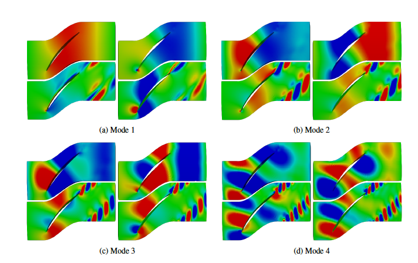
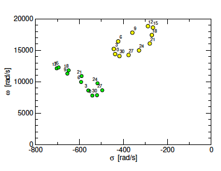
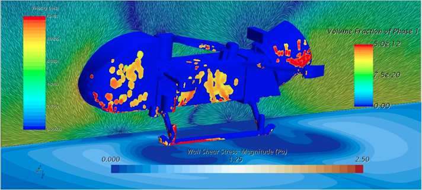
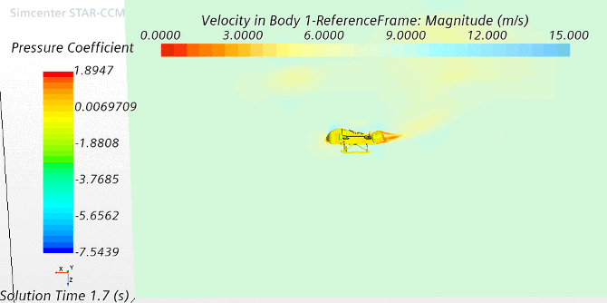

# 1. Educational Background with PhD 🚀

[← Back to Mission Control](../../README.md)

---

## 🎓 Duke University — Ph.D. Mechanical Engineering

**Aeroelasticity Group Graduate Research Assistant** &nbsp;·&nbsp; Aug 2022 – Present &nbsp;·&nbsp; Durham, NC

**Advisor**: Dr. Kenneth Hall · Duke Aeroelasticity Research Group  
**GPA**: 3.8  
**Tentative Dissertation**: Global Stability Analysis for Nonlinear Flow Instabilities via Harmonic Balance Techniques  

### Research Focus
- Develop **harmonic balance** numerical solvers for analysis of **non-synchronous vibrations (NSV)** in turbomachinery
- Build and extend an in-house **Fortran** numerical code to test novel analytical models for **fluid–structure interaction (FSI)** phenomena
- Target outcomes: nonlinear flow instability characterization with direct relevance to high-speed turbomachinery stability

## 🎓 Duke University — M.S. in Mechanical Engineering
**Aug 2022 – Dec 2024**
- Obtained En-Route through Ph.D. coursework & research

---

## 🎓 University of Central Florida — B.S. Aerospace Engineering (Honors)

Undergraduate foundation in aero / CFD before Duke. Two research tracks below.

### Undergraduate Research Assistant
**Jan 2019 – May 2021**

- Independent research projects in **Star-CCM+** CFD — setup, meshing, and analysis across multiple aero-focused studies

### NASA Dragonfly Project Research Assistant
**Mar 2020 – Jul 2021**

- Aerodynamic design & optimization analysis supporting **NASA Dragonfly** development
- Lagrangian multiphase flow **dust accumulation** analysis for Titan-relevant operating conditions

---

## 📄 Research Highlight 01 — Duke Academic Paper

### Paper Snapshot

| | |
|---|---|
| **Title** | Analysis of Flow Instabilities in Turbomachinery Using a Nonlinear Eigenvalue Problem Solver Derived from Harmonic Balance |
| **Venue** | **ISUAAAT17** — 17th International Symposium on Unsteady Aerodynamics, Aeroacoustics and Aeroelasticity of Turbomachines (Melbourne, Australia · Nov 16–21, 2025) |
| **Paper ID** | ISUAAAT17-116 |
| **Authors** | Kenneth C. Hall, Christopher Kaminski (Duke University) |
| **Status** | ✅ Presented — conference paper |
| **Role** | Coauthor — HB / nonlinear eigenvalue global-stability solver development with the Duke Aeroelasticity Group |
| **PDF** | [ISUAAAT-17_paper_116.pdf](./papers/ISUAAAT-17_paper_116.pdf) |

### Research Topic
- **Problem**: Rotating flow instabilities (rotating stall, **non-synchronous vibration / NSV**) are increasingly prevalent in jet engines as efficiency goals require higher bypass ratios and blade loading. Current analysis methods require either a computationally costly Navier-Stokes time-domain analysis, or reduced order modeling which can omit relevant parameters.
- **Method**: Derive a matrix-free **nonlinear, non-Hermitian eigenvalue problem (NEP)** from a **harmonic balance CFD** solver linearized about a steady base flow; use the linearized HB fixed-point iteration as a preconditioner and soft deflation to extract multiple eigenpairs at a cost of roughly **3–4 steady flow calculations per eigenpair**
- **Result**: Demonstrated on vortex-shedding stability for a cascade of cylinders and on 2D/3D unsteady compressor flow — showing the approach is feasible for realistic turbomachinery configurations in future global-stability studies

<em><strong>Figure 1.</strong> Purdue Rotor 2 compressor blade eigenmode plots found by the nonlinear eigenvalue solver (Modes 1–4).</em>

 

<em><strong>Figure 2.</strong> Root locus of the eigenmodes as a function of nodal diameter of the rotating flow instability (σ damping vs. ω frequency).</em>

### Artifacts
- [x] Conference paper PDF → [`./papers/ISUAAAT-17_paper_116.pdf`](./papers/ISUAAAT-17_paper_116.pdf)
- [x] Purdue Rotor 2 eigenmode plots → [`./assets/purdue-rotor2-eigenmodes.png`](./assets/purdue-rotor2-eigenmodes.png)
- [x] Root locus (nodal diameter) → [`./assets/root-locus-nodal-diameter.png`](./assets/root-locus-nodal-diameter.png)

---

## 📄 Research Highlight 02 — NASA Dragonfly (UCF)

### Research Snapshot

| | |
|---|---|
| **Project** | NASA **Dragonfly** — aerodynamic design, optimization, and Titan-relevant dust accumulation |
| **Lab** | Computational Fluids & Aerodynamics Laboratory — University of Central Florida |
| **Advisor** | Dr. Michael Kinzel |
| **Role** | NASA Dragonfly Project Research Assistant |
| **Dates** | March 2020 – July 2021 |
| **Tools** | **Simcenter STAR-CCM+** — CFD meshing, setup, and analysis |
| **Status** | ✅ Completed undergraduate research supporting Dragonfly development |

### Research Topic
- **Problem**: NASA Dragonfly is a rotorcraft lander for Titan. Near-surface flight in a dense atmosphere with lofted particulates creates two coupled design risks: aerodynamic performance in landing/hover, and **dust accumulation** on the airframe from rotor downwash.
- **Method**: Ran independent **STAR-CCM+** studies in Dr. Kinzel's lab spanning (1) **aerodynamic design and optimization** of the Dragonfly configuration and (2) **Lagrangian multiphase** dust-accumulation analysis under **Titan-relevant** operating conditions — volume-fraction tracking on the vehicle surface coupled to the near-field flow.
- **Result**: Landing / near-surface aero fields (pressure coefficient, wake, ground shear from downwash) and multiphase maps of where dust concentrates on the airframe — visual evidence of the STAR-CCM+ campaign.

<em><strong>Figure 1.</strong> Lagrangian multiphase dust accumulation: Volume fraction of dust on airframe gives probablistic heatmap of dust accumulation.</em>

 

<em><strong>Figure 2.</strong> STAR-CCM+ landing / near-surface aerodynamic analysis: surface pressure coefficient analysis during landing sequence.</em>

### Artifacts
- [x] Dust-accumulation CFD (volume fraction / wall shear) → [`./assets/dragonfly-dust-accumulation.png`](./assets/dragonfly-dust-accumulation.png)
- [x] Landing aero CFD (STAR-CCM+) → [`./assets/dragonfly-landing-cfd.png`](./assets/dragonfly-landing-cfd.png)

---

[← Back to Mission Control](../../README.md)

