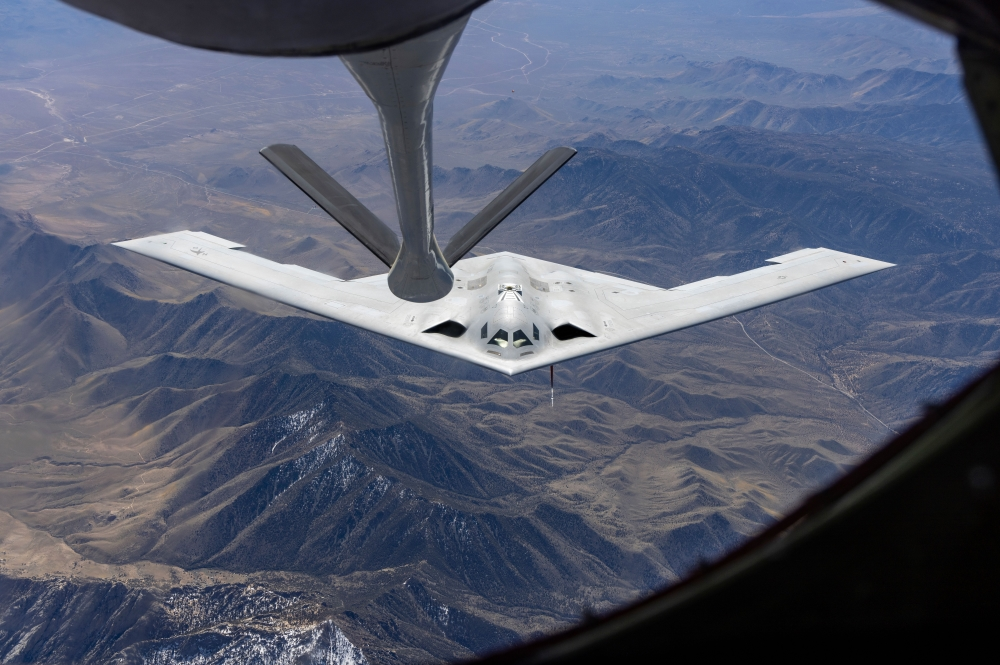

# 2. Northrop Grumman — B-21 Program 🛰️

**Associate Systems Engineer** &nbsp;·&nbsp; June 2021 – August 2022  
**College Intern – Technical** &nbsp;·&nbsp; May 2020 – August 2020

[← Back to Mission Control](../../README.md)

---

### Clearance
Acquired and maintained **U.S. Secret** clearance and **Special Access Program (SAP)** clearance.

---

## Associate Systems Engineer — B-21 Program
**June 2021 – August 2022**

Systems engineering on a major airworthiness / software-certification path: automation, subsystem test support, and Vehicle Management System (VMS) requirements ownership.

### Contributions
- **First Principles Thinking led to automation and early certification:** Built **Python** automation for each of my responsible subsystems. The automation process cut manual certification cycle time and got the Fuel and ECS software **certified substantially earlier** than parallel efforts led by more experienced engineering teams.
- **ECS — automation-driven airworthiness:** Supported and conducted airworthiness certification for the Environmental Control System. Due to the broad nature of this subsystem, this was a significant responsibility which I was entrusted with.
- **Fuel — certification testing:** Supported and conducted software airworthiness certification testing for the Fuel subsystem: test execution, evidence capture, and certification process close-out under program constraints.
- **VMS — requirements engineering:** Created and modified Vehicle Management System software engineering requirements for subsystem interfaces, with traceability to verification.

### What this demonstrates
- Certification and airworthiness rigor on a production defense program
- Ability to move between **automation (Python)**, **test execution**, and **requirements authorship** on the same vehicle stack
- Comfort operating under Secret / SAP constraints without needing public detail to show the engineering muscle

---

## College Intern — Technical
**May 2020 – August 2020**

Early systems-engineering exposure that led into the full-time B-21 role.

### Contributions

- **Aircraft test plan development:** Supported test-plan authorship by documenting test requirements, prerequisites, functions, objectives, approach, and test-equipment definition
- **ECS bleed-flow algorithm documentation:** Supported Environmental Control System **bleed flow algorithm** development and documented equation details for both **nominal** and **off-nominal** operating approaches

---

## Closing the Loop — Fuel Requirements to In-Flight Refueling

<em>Aerial refueling under way — the fuel subsystem operating at real mission stakes.</em>

The software requirements I created and the airworthiness certification work I supported for the **Fuel** subsystem had direct relevance to real in-flight hardware functionality. This process: **requirements → verification → airworthiness evidence** demonstrates the ability to perform high-stakes engineering validation. The same validation rigor was also applied to the Environmental Control System, for which I also had direct responsibility. 
---

[← Back to Mission Control](../../README.md)

